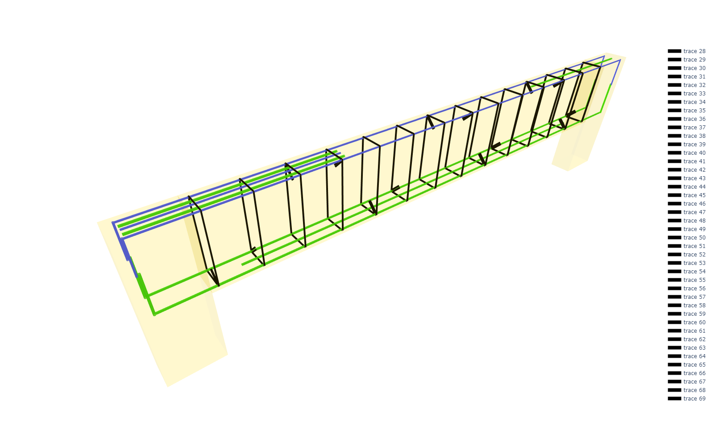
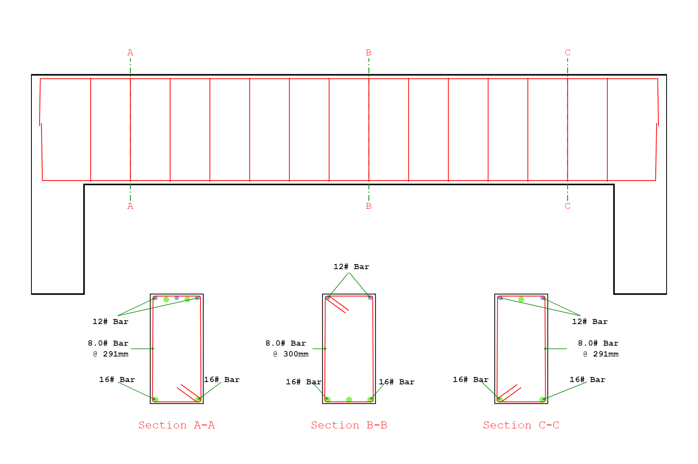

RCbeam - Class Variables
========================
All the methods of :class:`StrucPy.RCbeam` is of non-returning type. All the results are accessable using class variables after perforimg the specific operation. 

Reinforement Detail
----------------
Reinforcement detail can be accessed through **`rebar_detail`** variable, only after performing design or design optimization using `dsgbeam` and `beam_optimization` methods repectively. It gives the complete detail of reinforcement bars at critical sections of RC beam such as top reinforcement combination at left support, top reinforcement combination at right support, bottom reinforcement combination, continous bars, and development lengths. The result is presented in the form of dataframe, easy to understand and use.

**Type**: Dataframe

.. figure::  ./images/rd.png
   :align: center

----------------

Stirrups Detail
----------------
Stirrups detail can be accessed through **`shear_detail`** variable, only after performing design or design optimization using `dsgbeam` and `beam_optimization` methods repectively. It gives the complete detail of stirrup bars along the length of the beam. It not only provides the diameter and leg of bar but also eaxt number of bars, distance and cutoff lengths including hooks. 

**Type**: Dataframe

.. figure::  ./images/sd.png
   :align: center

----------------

Design Check Status
----------------
Design check status can be accessed through **`beam_status`** variable. It gives the detail wheather RC beam passed or failed in certain checks such as maximum rebar area limit, depth limit, deflection limit, etc. The result is presented in the form of dataframe, easy to understand and use.

**Type**: Dataframe

.. figure::  ./images/BS.png
   :align: center

----------------

3D Beam Detailing
----------------
3D RC beam detailing can be accessed through **`detailing3D`** variable, only after performing detailing using `plotting` method.

**Type**: Plotly.Figure

----------------

2D Beam Detailing
----------------
2D RC beam detailing can be accessed through **`detailing2D`** variable, only after performing detailing using `plotting` method.

**Type**: Plotly.Figure

----------------

Optimization Results
----------------
Optimization results can be accessed through **`optimization_results`** variable, only after performing design optimization using `beam_optimization` method. It gives the complete detail of the pareto front obtained during optimization. 

**Type**: Dataframe

.. figure::  ./images/bo.png
   :align: center

----------------

Reinforement Detail of Optimization Results
----------------
Reinforcement detail for all pareto front can be accessed through **`rd_list`** variable, only after performing design optimization using `beam_optimization` method. It gives the complete list of reinforcement bars detail corresponding to each pareto front front optimization result.

**Type**: List

----------------

Stirrups Detail of Optimization Results
----------------
Stirrups detail for all pareto front can be accessed through **`sd_list`** variable, only after performing design optimization using `beam_optimization` method. It gives the complete list of stirrup bars detail corresponding to each pareto front front optimization result.

**Type**: List

----------------
